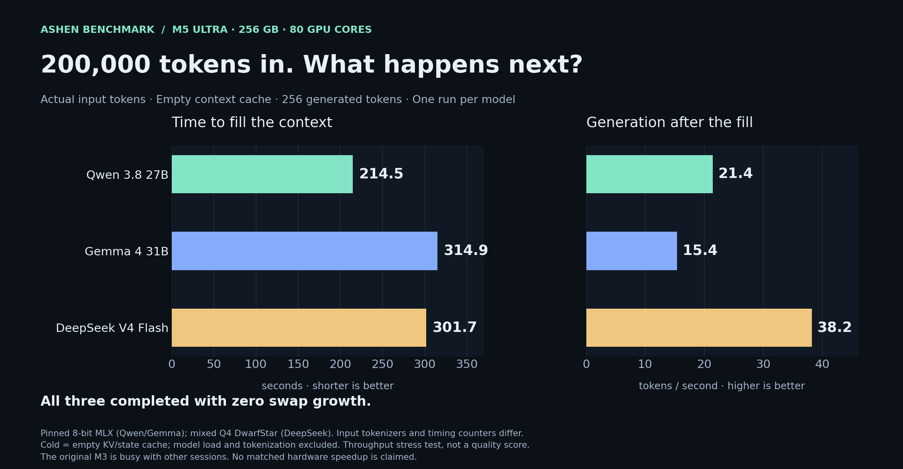

# Mac Studio Local Inference Tests Ashen

## Start with the 200K results — October 1, 2026

All three models completed **200,000 actual input tokens plus 256 output tokens** on the new M5 Studio:

| Pinned configuration | Empty-cache context fill | Input tok/s | Output tok/s after 200K |
|---|---:|---:|---:|
| Qwen 3.8 27B, 8-bit MLX | 3m 34s | 933.63 | **21.44** |
| Gemma 4 31B, 8-bit MLX | 5m 15s | 635.74 | **15.41** |
| DeepSeek V4 Flash 0731, mixed Q4 | 5m 02s | 662.81 | **38.20** |



One measured long-context run per model; no swap growth. These are throughput stress tests, not quality scores. Cache definitions, runtime differences and raw records are in the [campaign report](docs/LONG-CONTEXT-CAMPAIGN.md). The earlier [short-context setup checks](results/m5-firstlook-20261001/README.md) remain available but are not the headline result.

**The original M3 GPU is busy with the owner's other sessions. No matched M3/M5 percentage is claimed.** The [live handoff](HANDOFF.md) tracks the official AA replay, Blender condition, [repository diagnostic](docs/REPO-DIAGNOSTIC.md) and [Darkbloom installation last](docs/DARKBLOOM.md). Changes and results are being reviewed in [PR #3](https://github.com/oh-ashen-one/Mac-Studio-Local-Inference-Tests-Ashen/pull/3).

**Also completed on M5:** the official AA replay served 168/168 turns with zero failures in 16m 29s ([report](results/m5-aa-full-alone-20261001/README.md)); the separate large-context Django diagnostic passed **4/5 fresh attempts with zero rescue**, including one retained failure ([report](results/m5-repo-qwen-summary-20261001/README.md)).

**Additional downloaded models:** Qwen 3.6 35B A3B FP4 (21.3 GB) and MiMo V2.6 Flash MXFP4 (172.9 GB including its audio tokenizer) are fully checksum-verified in a [separate lock](config/additional-models.lock.json). The owner-authorized Qwen download retry succeeded. Their independent-runtime campaign is active: three 200K speed samples, five bounded repository attempts and separately labeled official replay cells per compatible model. Initial loader failures and MiMo's strict JSON-format miss remain in the raw evidence. Darkbloom's provider is not running. [Method and runtime qualification](docs/ADDITIONAL-MODEL-CAMPAIGN.md). [Additional results](results/m5-additional-summary-20261001/README.md): Qwen 3.6 has completed three 200K runs at **79.78 tok/s median** (79.64–79.96), **66.69s median fill**, zero swap; its repository diagnostic finished at **4/5 attempts passed** (median 8m 45s, no rescue). The failed fourth trial is retained. The [full recorded-policy replay](results/m5-aa-qwen36-full-recorded-20261001/README.md) served 168/168 turns in 10m 05s (37.83 end-to-end tok/s), explicitly non-comparable to the original exact-length cell. MiMo’s 200K campaign is now active.

The read-only visual dashboard is `http://127.0.0.1:18765` **on the new Studio**. To show saved records elsewhere, run `.venv/bin/python scripts/preview.py`. It cannot launch inference. Prompts/responses are collapsed; context-fill timelines, generation speeds, memory and source-linked external configurations are prominent.

## Start here — preparation only

**Do not start a model or inference run merely from reading this README.** Reading this README is a handoff to prepare files and tools only. Wait for the owner to explicitly say **“start the tests”** before GPU work. Follow [AGENTS.md](AGENTS.md).

On the new Studio, after connecting to the internet, an agent can prepare the identical installation with:

```sh
git clone --branch codex/long-context-dashboard-20261001 https://github.com/oh-ashen-one/Mac-Studio-Local-Inference-Tests-Ashen.git
cd Mac-Studio-Local-Inference-Tests-Ashen
bash scripts/prepare.sh
```

This installs the pinned runtime, downloads the three exact artifacts, verifies every file, writes a `work/READY.json` receipt, and **stops without loading models**. Apple's command-line developer tools must be installed; if macOS needs its one-time installer dialog, complete that and rerun. Model transfers from the old Studio can replace downloading; see [the arrival guide](docs/ARRIVAL.md).

For this already-prepared Studio, return to this chat and say **“start the tests”** when the GPU is available. Results will be reviewed on **localhost before any website publication**. [Current preparation status](docs/SETUP-STATUS.md).

An open, reproducible record of my personal local-AI tests: my existing Mac Studio versus my incoming 256 GB / 2 TB Mac Studio, followed by experiments using both machines together.

**Status: both Studios are prepared with the same three model artifacts and matched runtime versions. All 34 selected model files are SHA256 verified on the M5. See HANDOFF.md for active M5 campaign work; no controlled M3/M5 comparison results yet. [Paired setup receipt](docs/M5-READY.md).** The existing machine was inspected directly on September 29, 2026. The owner has confirmed the incoming M5 Ultra order (36-core CPU, 80-core GPU, 32-core Neural Engine, 256 GB / 2 TB). Its physical device and OS have now been inspected; see the paired setup receipt. This is an independent personal experiment with one machine of each configuration, not a claim about every Mac or every model.

## What I want to find out

1. How much faster is the new Studio on exactly the same model and settings?
2. Which local models give the best useful answers per second, per watt, and per task?
3. How do context length, quantization, thinking, and concurrency change the answer?
4. Can both Studios run a model that is impractical on either alone? At what latency?
5. Is one distributed big model more useful than two independent local agents?
6. Finally: can these machines build a complete game in a controlled local-model loop, documented for YouTube?

The results will be linked from **[Ashen Benchmark](https://ashenoneport.com/benchmark)**. The website entry starts as “planned”; charts and conclusions follow verified runs. The game-building video comes last.

## The machines

| Field | Existing Studio: directly observed | Incoming Studio: owner-confirmed order |
|---|---|---|
| Chip | Apple M3 Ultra | Apple M5 Ultra, directly observed |
| CPU | 32 cores: 24 performance + 8 efficiency | 36 cores |
| GPU | 80 cores | 80 cores |
| Unified memory | 256 GB; `hw.memsize` = 274,877,906,944 bytes | 256 GB, owner-confirmed |
| SSD | 2.0 TB; 2,001,111,162,880 bytes | 2 TB, owner-confirmed |
| Model identifier | Mac15,14 | Mac17,15 |
| OS at latest inventory | macOS 27.0.1, build 26A434 | macOS 27.0.1, build 26A434 |
| Memory bandwidth | 819 GB/s, Apple specification | 1.2 TB/s, current Apple top-chip specification; pending machine confirmation |
| Interconnect | Thunderbolt 5 and 10Gb Ethernet per Apple specification | Thunderbolt 5 and 10Gb Ethernet per current Apple specification; pending inspection |

**The 80-core number is the GPU, not the CPU. Both machines have 256 GB memory.** More RAM is therefore not the proposed upgrade's advantage; chip architecture, memory bandwidth, supported kernels and practical workload performance are what we need to measure. GPU core counts alone cannot predict speed.

The incoming configuration is now explicitly confirmed by the owner and matches [Apple's current specifications](https://www.apple.com/mac-studio/specs/). Direct inventory now confirms the delivered chip, CPU/GPU core counts, memory and storage. “Top-chip, 256 GB / 2 TB” is more precise than “fully maxed out”: Apple's current specifications also list larger memory and storage configurations. Historical M3 figures come from [Apple's 2025 specifications](https://support.apple.com/en-us/122211).

A theoretical bandwidth ratio is not a tokens-per-second prediction. We will publish measured ratios only after matched runs.

## Three comparisons, kept separate

| Track | What stays fixed | What it tells us |
|---|---|---|
| Hardware parity | Exact weights, tokenizer, quantization, runtime revision, prompts and sampling | Speed difference attributable to the machine under that software stack |
| Best practical setup | Published optimization budget and quality floor; each machine may use its best supported setup | What an owner can actually get from each computer |
| Quality frontier | Explicit model, quantization, thinking, time and context budgets | Which configuration solves the most tasks within a useful latency budget |

Faster hardware does not inherently make the same weights more intelligent. It may allow more attempts or more reasoning in a fixed time. Equal-token quality and equal-time usefulness are separate results.

## Benchmark coverage

| Suite | Workloads | Primary outputs |
|---|---|---|
| Single request | Short chat, code, long documents; fresh and reused prefixes | Time to first token, prompt tok/s, decode tok/s, total latency |
| Load and concurrency | 1, 2, 4, 8 requests; closed-loop and fixed arrival-rate runs | Per-user latency, aggregate tok/s, requests/minute, errors |
| Context and memory | 512, 2K, 8K, 32K, 64K, 128K input tokens where supported | Usable context, resident memory, swap delta, latency and retrieval accuracy |
| Quantization | 4-bit, supported 6-bit, 8-bit; BF16 reference for fitting smaller models | Speed/memory/quality trade-off, exact artifact sizes |
| Quality | Coding, reasoning, instruction following, tool calls, long-context retrieval | Exact task scores, success rate, confidence intervals, correct tasks/hour |
| Sustained work | 30-minute screening; two-hour finalist runs; optional eight-hour run | Drift, throttling, crashes, memory growth, energy/task |
| Two-machine cluster | Independent servers, pipeline sharding, supported tensor sharding | Latency, throughput, capacity, network cost, reliability |
| Final game loop | Same frozen brief and checks; equal-time and equal-token lanes | Time to playable build, accepted features, failures, owner review |

For every suite, failures, unsupported configurations, timeouts and out-of-memory outcomes are published. No cherry-picked best runs.

## Selected arrival-day models

The initial three are **Qwen 3.8 27B (8-bit MLX), Gemma 4 31B IT (8-bit MLX), and DeepSeek V4 Flash 0731 (calibrated mixed Q4, DwarfStar/Metal)**. They are standard checkpoints/conversions, not abliterated variants. Mistral and the initially considered R1 distill are excluded.

The exact files total about 228 GB. Immutable revisions and SHA256 hashes live in [the model lock](config/models.lock.json); downloaded weights remain outside Git. Hugging Face popularity was checked live, but downloads/likes are not intelligence scores. Each model is run one at a time and compared against the identical model/engine on the other Mac.

**[Arrival-day setup and test commands](docs/ARRIVAL.md)** explain the selection, pinned software, transfer/SSH preparation, resource gates, and the implemented first campaign. Larger models and distributed capacity tests remain later stages in [the broader model plan](docs/MODELS.md).

## Runtime strategy

The implemented arrival cohort uses **MLX / MLX-LM** for Qwen/Gemma and **DwarfStar / Metal** for DeepSeek V4 Flash. **llama.cpp / Metal** remains a planned independent baseline. Match model and settings *within* each backend first. MLX 4-bit and GGUF Q4 variants are not numerically identical formats; do not attribute their difference to hardware alone.

LM Studio and Ollama can be added as user-experience tracks after the underlying engines are measured; record the actual bundled backend and loaded model. Test speculative decoding, prompt caching, quantized KV cache, batching and new-chip-specific acceleration as separate ablations. Keep these off in the basic comparison where possible. New hardware features count only when the selected runtime actually uses them.

For clustering, start with **MLX distributed / JACCL over a direct Thunderbolt 5 link**, then evaluate **EXO** as an orchestration layer. Validate mixed M3/M5 support before downloading giant models. See [the cluster plan](docs/CLUSTER.md).

## Execution order

1. **Inventory and freeze:** inspect both machines, lock software/model revisions and prompt IDs, reserve quiet test windows and disk budgets.
2. **Pilot:** run one small and one 27–32B model on both machines; validate token counts, clocks, outputs and telemetry.
3. **Core speed:** complete the small fixed matrix, then expand only the dimensions needed to explain observed differences.
4. **Quality and capacity:** test the shortlist with full declared task sets, quantization comparisons and longer contexts.
5. **Sustained and concurrent work:** measure finalists under realistic service load and long runs.
6. **Cluster:** establish network baselines, prove a small distributed model, then attempt large models.
7. **Publish:** produce reproducible raw records, plots and an Ashen Benchmark summary.
8. **YouTube/game finale:** use the proven models and frozen loop protocol; preserve the full run before editing the story.

Planning allowance after both machines are ready: roughly 1 day of setup/pilots, 2–4 days of core and quality work, 1–3 days of cluster/reliability work, then reporting. This is an estimate, not a promised runtime: pilot measurements determine a logged run budget. A deliberately bounded release is more reproducible than an endlessly expanding matrix.

## Detailed plans and current artifacts

- [Measurement protocol and publication rules](docs/PROTOCOL.md)
- [Two-Mac clustering and memory fit](docs/CLUSTER.md)
- [Model selection and provenance](docs/MODELS.md)
- [Website and final YouTube/game phase](docs/PUBLISHING.md)
- [Sanitized existing-machine inventory](hardware/existing-studio.json)
- [Incoming-machine placeholder](hardware/incoming-studio.json)
- [Result record template](results/run-template.json)
- [Reproducible, allowlisted hardware collector](scripts/collect_inventory.py)

The arrival preparation implements pinned downloads, an inventory collector, smoke checks, fixed-token speed runners, a matched-results comparer and local diagnostic tools. Standardized quality suites, concurrency/power/cluster automation and website charts remain later work. See [ARRIVAL.md](docs/ARRIVAL.md) and [the setup status](docs/SETUP-STATUS.md) for exactly what has been validated. Setup smoke checks are not controlled benchmark results.

To collect a privacy-conscious inventory without running a benchmark:

```sh
python3 scripts/collect_inventory.py --machine-id studio-new > hardware/incoming-studio.json
```

Review the JSON before committing. The collector excludes serial numbers, UUIDs, hostnames, account names and network addresses. It does not install software, start engines or download models.

## Open-source and contribution policy

Project-owned code and documentation are **MIT licensed**. Model weights and benchmark datasets keep their original licenses; open weights do not automatically mean unrestricted open source. We distribute model references and hashes, not weights or private datasets.

Please include machine specs, exact revisions, full settings, raw measurements and all failure records when contributing. Community submissions are separate from the two-machine personal comparison. Work on a branch, push it, and open a PR. Merging into `main` requires the owner's approval. The published preparation branch is `codex/setup-20260930`. No merge into `main` is required to read or use this kit; future work must use its own branch.

Before publishing, remove credentials, personal filesystem paths, IP addresses, private prompts, serial numbers and UUIDs. Keep needed sanitized evidence in Git or a named release; discard task-owned temporary captures/builds after verification and publication. Never remove shared model caches or another session's work.

By [Ashen](https://x.com/ashen_one).
