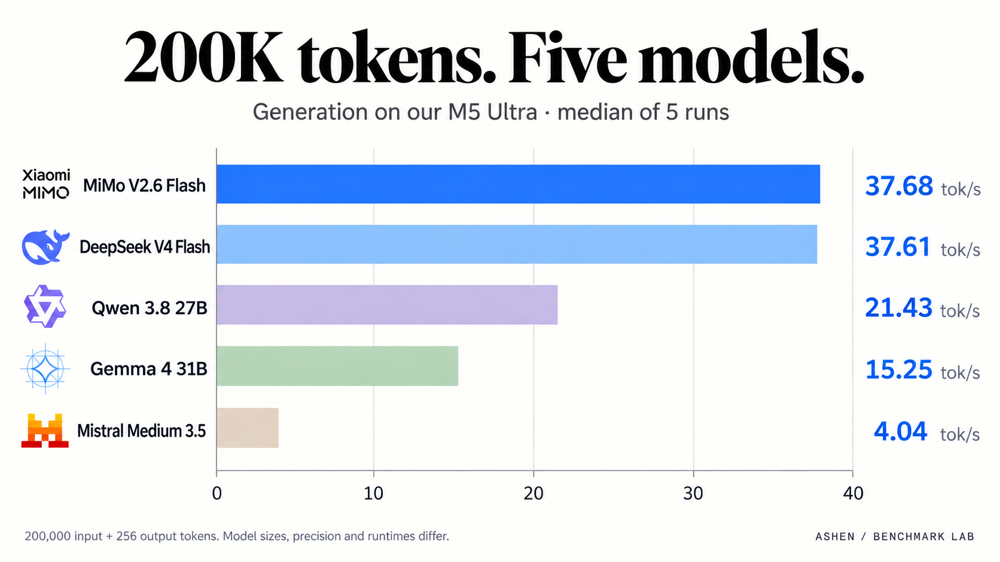
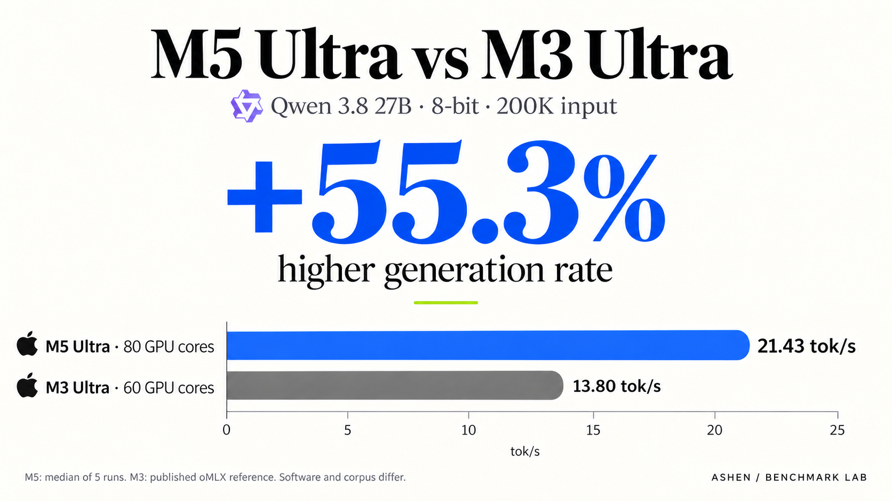

# M5 Ultra local AI benchmarks — Ashen

An independent local-inference study on an **M5 Ultra, 80 GPU cores, 256 GB unified memory**, covering speed, long context, sustained generation, coding, repository repair, retrieval and serving load.

**Study closed October 4, 2026; published October 5.** All **194 final required groups** are accounted: **183 completed and 11 actually attempted but unscored**. One additional trial from the original195-group scope was explicitly omitted by the owner. Coverage is not a task-success rate; functional failures and all resource/request limits remain in the evidence.

**[Read the full research report](docs/M5-RESEARCH-REPORT-20261004.md)** · **[Browse the raw results](results/)** · **[Methods and locked budgets](docs/UNIFIED-OVERNIGHT-PROTOCOL.md)** · **[Final scope and closeout](results/study-closeout-20261004/completion-audit.json)**

## The study at a glance

| Retained study coverage | Count |
|---|---:|
| Model configurations | 5 |
| Cold-speed measurements, five repeats at8K/32K/128K/200K | 100 |
| Sustained200K-input /2048-output runs | 15 |
| Restricted chat-adapted HumanEval cases | 820 |
| Measured serving requests across concurrency1/2/4 | 900 |
| Recorded agent-replay requests served | 840 |
| Structured-output cases | 120 |
| Retrieval cases actually attempted | 45 |

The retained configurations are **Qwen3.8 27B8-bit MLX, Gemma4 31B8-bit MLX, DeepSeek V4 Flash mixedQ4, MiMo V2.6 Flash MXFP4, and Mistral Medium3.5 128B Q4_K_M**. Model sizes, quantization, runtimes and tokenizers differ. Historical Qwen3.6 and QwenQ4 results remain available separately; they are not pooled into the five-configuration totals above.

## Long-context generation



Five-run medians of backend-reported generation speed, in tokens per second:

| Configuration |8K input|32K input|128K input|200K input|
|---|---:|---:|---:|---:|
|Qwen3.8 27B ·8-bit MLX|30.58|28.93|24.45|21.43|
|Gemma4 31B ·8-bit MLX|25.85|24.17|19.15|15.25|
|DeepSeek V4 Flash ·mixedQ4|55.35|51.82|41.57|37.61|
|MiMo V2.6 Flash ·MXFP4|65.70|59.43|44.49|37.68|
|Mistral Medium3.5 128B ·Q4_K_M|12.56|9.98|5.35|4.04|

These are post-fill generation rates with256 output tokens, not time-to-first-token or task-success scores. The report includes input-processing time, all repetitions, observed ranges, native usage/cache counters, memory/swap and failures. Mistral's median200K input fill took about82 minutes; completing that speed test does not establish successful200K requests under the900-second useful-work budget.

## Published Mac and GPU comparisons



At200K input, our five-run Qwen8-bit median was21.4262tok/s versus the published M3 60-GPU configuration's13.8tok/s: a **55.3% reported rate difference**. At131072 input,24.4479 versus the published M3 80-GPU configuration's17.2tok/s gives **42.1%**. Software and corpus differ. **These comparisons do not isolate a chip-only speedup, and there is no matched M3 inference cohort in this study.**

The [source review](research/showcase-source-review-20261004.json) records the primary references. The [market comparison](viewer/assets/infographic-market.png) includes optimized M3, DGX Spark and RTX5090 reports with their different prompts, precisions, acceleration and timing boundaries. It assigns no matched hardware-winner claim.

## Useful work and limits

| Configuration |HumanEval passed /164|8-turn repair|20-turn repair|
|---|---:|---|---|
|Qwen3.8|158|4/5 completed trials|3/3 completed trials|
|Gemma4|159|5/5 completed trials|3/3 completed trials|
|DeepSeek V4 Flash|148|5/5 completed trials|3/3 completed trials|
|MiMo V2.6 Flash|154|1/5 completed trials|2 resource-limited attempts;1 owner omission|
|Mistral Medium3.5|151|5 request-budget-limited attempts|3 request-budget-limited attempts|

HumanEval is a restricted chat adaptation with one greedy sample per problem and CPU-qualified sandbox evaluation, not an official leaderboard submission. Unscored limits and unrun omissions are not zero accuracy scores. The report also preserves all nine Mistral retrieval timeouts, both actual MiMo Metal allocation failures, the slow DeepSeek sustained repetition and replay warnings. Served replay requests are not tasks solved.

## Evidence and reproducibility

- [Final report and interpretation](docs/M5-RESEARCH-REPORT-20261004.md)
- [Frozen source summaries and report receipt](results/research-report-20261004/)
- [Baseline aggregate and per-run links](results/unified-overnight-20261002/README.md)
- [Separate Mistral results and coverage](results/mistral-extension-20261003/README.md)
- [Full Mistral completion audit](results/mistral-campaign-completion-20261004/)
- [Locked baseline model configurations](config/unified-models.lock.json) and [Mistral lock](config/mistral-models.lock.json)
- [Protocol, request/job budgets and guards](docs/UNIFIED-OVERNIGHT-PROTOCOL.md)
- [Owner-approved final scope](docs/OWNER-FINAL-MIMO-OMISSION-20261004.md) and [owned inference-exit proof](hardware/owned-inference-exit-closeout-20261004.json)
- [Visualization sources, image prompts and validation](docs/VISUAL-SHOWCASE-20261004.md)

Weights, credentials, private machine adapters and runtime environments are excluded from Git. Model references, revisions, hashes, sanitized records and intentional result releases are versioned. Project-owned code and documentation are MIT licensed; model artifacts, datasets and third-party marks retain their own licenses.

## View the visual research

The integrated portfolio pages are in [Ashen-Port-Site](https://github.com/oh-ashen-one/Ashen-Port-Site), with the benchmark library at `/benchmark` and the full study at `/benchmark/mac-studio`. The approved website code is merged into its main branch; the owner handles redeployment.

To inspect the saved standalone results locally, use the prepared environment:

```sh
.venv/bin/python scripts/preview.py --port18765
```

Open `http://127.0.0.1:18765/` on that machine. This read-only viewer cannot start inference. See [dashboard and private-preview instructions](docs/DASHBOARD.md). The [earlier README and preparation plan](docs/archive/README-BEFORE-RESULTS-PUBLICATION-20261005.md) are retained as history.

**Automatic inference remains stopped after two actual GPU safety events.** Reading or cloning this published record does not authorize model loading, qualification, retries or further tests. Follow [AGENTS.md](AGENTS.md) and the current [handoff](HANDOFF.md).

By [Ashen](https://x.com/ashen_one).
