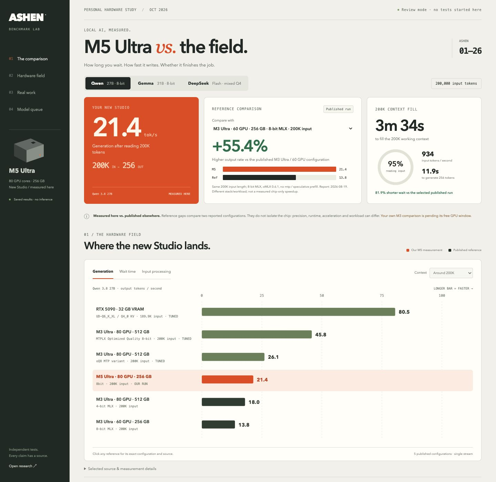

# Visual comparison dashboard

The localhost viewer is read-only: it renders saved data, performs no model inference and has no test-start endpoint. On the M5 it runs at `http://127.0.0.1:18765`; controller review uses its own loopback SSH forward.

The main view includes:

- Three measured-model selectors and a prominent reference selector.
- Generation-rate difference against a selected published run, only when actual input length matches 200,000 tokens. Formula: `100 × (our rate / reference rate − 1)`.
- Context-fill time reduction, only for a same-length reference with reported latency. Formula: `100 × (1 − our fill time / reference wait)`.
- A hardware bar chart with generation, wait and prefill modes, plus a context-length filter. Single-stream reports only; multi-user aggregate throughput is not plotted on that axis. Precision, context and tuned variants remain visible.
- An actual fill/generation time breakdown, the five repository outcomes, and the official replay counters.
- Additional-model discovery status and the owner's explicit Darkbloom hold.

A published-run gap is a **configuration comparison**, not an isolated hardware effect. Different model conversions, runtimes, software versions, sampling, cache state and workloads can change the result. The default Qwen reference is a **60-GPU-core** M3 Ultra, not the owner's 80-GPU-core original Studio. Tuned results can outperform the current M5 baseline and are shown. No claim to cover all hardware or the global fastest configuration is made.

The owner's own M3/M5 percentage remains pending until matched runs exist. Historical Gemma April results retain their date and older runtime. For absent/different context lengths, the UI names the missing context and shows the raw tok/s gap without a hardware percentage. DeepSeek explicitly shows 38.20 vs 36.01 tok/s, a 2.19 tok/s reported gap, with the reference context marked unknown. Raw prompts and methodology are collapsed. Original sources are accessible by selecting a graph row.

Assets are local HTML/CSS/JavaScript with SVG charts; no external font, chart service or analytics dependency. Model files, caches and private paths are not served. Narrow layouts keep the wide comparison graph in its own horizontal scroll area.

## Viewing from the laptop

The benchmark preview runs on the Studios. `localhost` in a laptop browser refers to the laptop itself, so the Studio loopback URL does not provide cross-machine access.

The controller now exposes the existing read-only preview on TCP port18765 through **Tailscale Serve, privately within the existing tailnet**. Connect Tailscale on the laptop, then open `http://<Studio-Tailscale-IP>:18765/`; discover the current Studio address with `tailscale status`. No public Funnel or website deployment is enabled. Existing Tailscale Serve ports are preserved. The private address and exact previous Serve configuration are retained only in ignored task-local `work/` receipts.

The Studio-side endpoint and closed-study API were verified. The laptop showed offline at setup, so end-to-end laptop access requires its Tailscale connection and has not yet been observed from the laptop. The service forwards to the existing controller loopback SSH connection; `work/preview-forward.pid` identifies that owned forward. This access change does not restart the M5 preview, run inference or resume the paused benchmark follow-up.

To remove only this task's private preview route when requested: `tailscale serve --tcp=18765 off`. Do not use a global Serve reset, which would remove other owners' routes.
