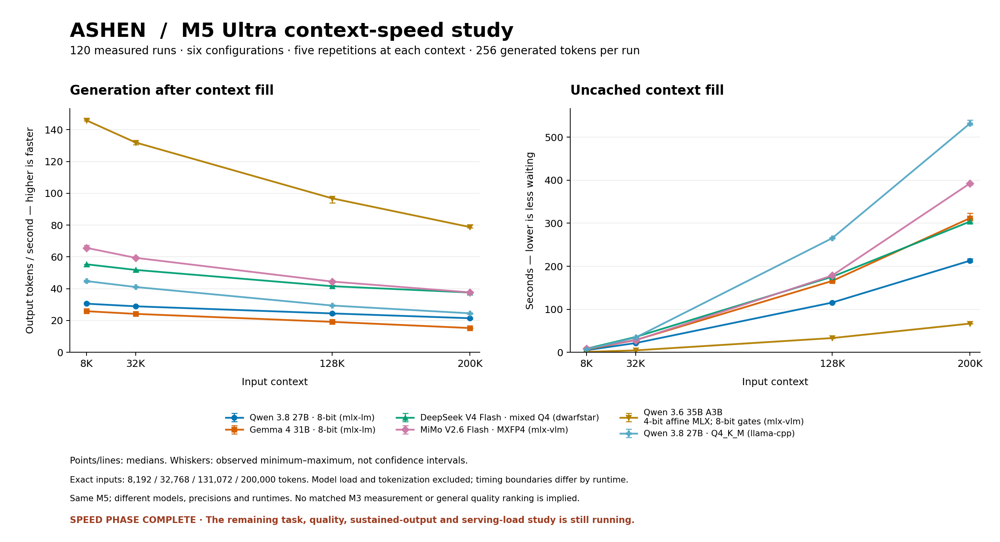

# M5 context-speed phase — 120 measured runs

**Speed phase complete; the overall 234-group study remains in progress.** Six configurations, four input lengths, five fresh-process repetitions each, 256 output tokens per run. All 120 results passed exact-count, cohort and publication-receipt checks.

[Frozen protocol](../../docs/UNIFIED-OVERNIGHT-PROTOCOL.md) · [Full-study progress](../unified-overnight-20261002/README.md) · [Research notes](../../docs/UNIFIED-RUN-NOTES.md) · [Statistics and 120-run manifest](summary.json)

[Editable SVG figure](../../outputs/unified-speed-phase.svg) · [Figure provenance](figure-provenance.json)

## Median generation rate (tokens/second)

| Configuration | 8192 input | 32768 input | 131072 input | 200000 input |
|---|---:|---:|---:|---:|
| Qwen 3.8 27B · 8-bit | 30.58 | 28.93 | 24.45 | 21.43 |
| Gemma 4 31B · 8-bit | 25.85 | 24.17 | 19.15 | 15.25 |
| DeepSeek V4 Flash · mixed Q4 | 55.35 | 51.82 | 41.57 | 37.61 |
| MiMo V2.6 Flash · MXFP4 | 65.70 | 59.43 | 44.49 | 37.68 |
| Qwen 3.6 35B A3B · 4-bit MLX (affine; 8-bit gates) | 145.89 | 131.97 | 96.83 | 78.77 |
| Qwen 3.8 27B · Q4_K_M | 44.80 | 41.07 | 29.42 | 24.52 |

## Median context-fill time (seconds)

| Configuration | 8192 input | 32768 input | 131072 input | 200000 input |
|---|---:|---:|---:|---:|
| Qwen 3.8 27B · 8-bit | 4.961 | 21.437 | 115.589 | 212.930 |
| Gemma 4 31B · 8-bit | 6.359 | 28.510 | 165.833 | 311.842 |
| DeepSeek V4 Flash · mixed Q4 | 8.342 | 35.631 | 175.570 | 303.859 |
| MiMo V2.6 Flash · MXFP4 | 8.418 | 27.930 | 178.426 | 392.706 |
| Qwen 3.6 35B A3B · 4-bit MLX (affine; 8-bit gates) | 0.928 | 4.526 | 33.092 | 66.722 |
| Qwen 3.8 27B · Q4_K_M | 6.738 | 34.279 | 265.209 | 531.977 |

Every table cell is n=5. JSON retains mean, sample standard deviation, minimum, maximum and each run reference; no outlier was dropped. The plotted whiskers are observed ranges, not confidence intervals.

## Memory observations at 200000 input

| Configuration | Minimum system memory available, GiB | Maximum whole-job swap growth, MiB | Peak MLX allocation, GiB |
|---|---:|---:|---:|
| Qwen 3.8 27B · 8-bit | 167.41 | 0.0000 | 41.95 |
| Gemma 4 31B · 8-bit | 165.23 | 0.0000 | 49.91 |
| DeepSeek V4 Flash · mixed Q4 | 66.25 | 0.0000 | Not an MLX metric |
| MiMo V2.6 Flash · MXFP4 | 18.20 | 3.0625 | 210.36 |
| Qwen 3.6 35B A3B · 4-bit MLX (affine; 8-bit gates) | 192.18 | 0.0000 | 23.82 |
| Qwen 3.8 27B · Q4_K_M | 193.25 | 0.0000 | Not an MLX metric |

Available memory and swap are system-wide samples over the whole child including verification/load; not process attribution. MLX allocation is a separate metric and is not substituted for native process RSS.

MiMo has zero positive timed-inference swap change in these groups but small whole-job system-swap increases. Loading and timed inference must not be described interchangeably. Available memory is an observed minimum, not a promise that any second application will fit.

## Interpretation and reproducibility

Model load/tokenization excluded. MLX: direct uncached input to first token. DwarfStar: native prefill counters. llama.cpp: HTTP first output with native counters retained.

These are coupled model/precision/runtime configurations on one verified M5 Ultra. Tokenizers differ across model families; the two Qwen 3.8 configurations have identical input token IDs at each length. The original M3 remains unmeasured. Published external configurations are not substituted for a controlled paired test.

Speed is not intelligence, task completion or an absolute hardware ceiling. Repository repetitions, longer repair budgets, full recorded replay, HumanEval, retrieval, sustained generation and serving-load coverage remain separate and unfinished. Replays measure serving, not tasks solved.

Historical unwired MiMo measurements and the residency setup probe are excluded. Original failed setups and unsuccessful task attempts remain preserved in the full-study evidence. No model upgrade, quantization swap, silent context shortening, retry or outlier removal was used to complete this speed phase.

Regenerate JSON/Markdown with `python3 scripts/report_unified_speed.py`. For PNG/SVG, install `config/requirements-plotting.lock` into an isolated plotting environment and add `--figures`; the script uses the CPU-only Agg backend and never imports or starts an inference runtime.
